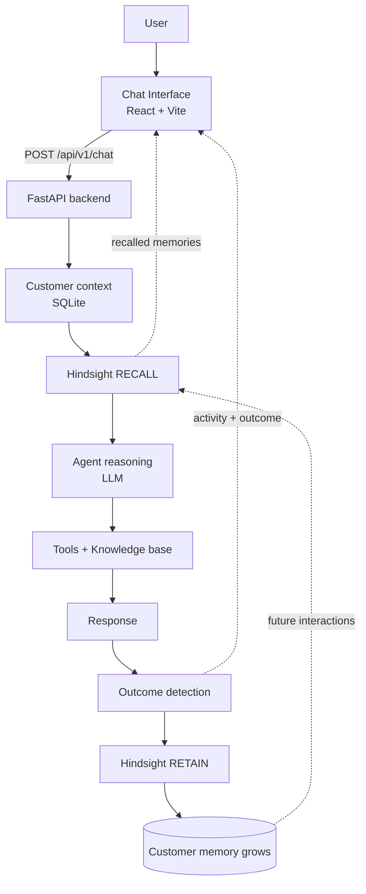
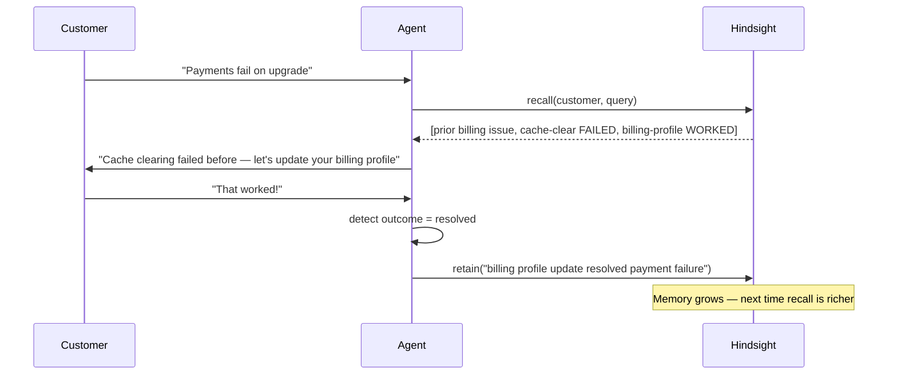

# RecallDesk

**Support that remembers what happened.**

RecallDesk is an AI customer-support agent for a fictional SaaS product (**Nexora Workspace** by **Nexora Cloud**) with a **persistent long-term memory layer powered by [Hindsight](https://hindsight.vectorize.io/)**.

Unlike a normal chatbot that treats every conversation as a blank slate, RecallDesk remembers each customer's history: the problems they hit, the environment they run, the troubleshooting that was attempted, **which fixes worked, which failed**, their preferences, and the commitments support made. It gets more useful the more a customer interacts with it.

```
INTERACTION → RETAIN → RECALL → LEARN → ADAPT
```

---

## 1. The problem

Traditional support bots are stateless. Every session starts from zero, so customers:

- repeat their whole history every time,
- get told to try fixes that **already failed** for them,
- never benefit from a resolution that worked last month.

Human agents keep notes, but those notes are unstructured, siloed, and rarely recalled at the right moment.

## 2. The solution

RecallDesk gives the agent a **per-customer memory bank** in Hindsight. On every request it:

1. recalls the customer's relevant past experiences,
2. reasons with that memory plus a general product knowledge base,
3. **avoids fixes that previously failed** and **leads with what previously worked**,
4. detects the outcome of the conversation,
5. retains the useful parts back into Hindsight.

## 3. Why persistent memory matters

| | Without memory | With Hindsight |
|---|---|---|
| Payment fails again | "Please try clearing your cache and retrying." | "Cache clearing didn't resolve your issue last time. Updating your billing profile did — let's start there." |
| Repeat integration issue | Generic OAuth walkthrough | "Your Slack integration was fixed by re-authorizing OAuth on Sep 12 — same fix likely applies." |
| Escalation | Human agent starts from scratch | Handoff summary carries full history, what worked, what failed |

This before/after difference is the core of the demo and is a first-class feature in the UI.

## 4. General knowledge vs. customer memory

RecallDesk deliberately separates two kinds of knowledge:

- **Knowledge Base (SQLite)** — *general* product documentation that applies to every customer (how password reset works, common causes of sync failures, etc.).
- **Hindsight memory** — *customer-specific* lived experience: what happened to **this** customer and how it turned out.

The agent combines both: the KB tells it *how a fix works*; memory tells it *whether that fix already failed for this person*.

## 5. Architecture



**Per-request pipeline** (`backend/app/agents/support_agent.py`):

1. Identify the customer (SQLite).
2. Recall relevant memories from Hindsight (`with_memory` mode only).
3. Build a system prompt injecting the recalled memory context.
4. Call the LLM with a tool loop (max 3 iterations).
5. Detect the outcome (`resolved` / `failed` / `escalated` / `ongoing`).
6. Extract and retain the useful memory back into Hindsight.
7. Persist messages and return response + full activity trace to the UI.

## 6. Hindsight integration

Hindsight is the **actual memory mechanism** — not a chat-history table. It lives in `backend/app/hindsight/manager.py`, which wraps the official SDK and exposes:

| Operation | Purpose |
|---|---|
| `create_bank(customer_id, name, plan)` | one memory bank per customer (`recalldesk-customer-{id}`) |
| `retain(customer_id, content, context, metadata)` | store a meaningful outcome |
| `recall(customer_id, query, budget)` | retrieve relevant memories for the current message |
| `reflect(customer_id, query)` | deeper reasoning over the bank |
| `list_memories(customer_id)` | enumerate a bank for the Memory panel |

**Modes**
- **Embedded** (`HINDSIGHT_EMBEDDED=true`, default): a `HindsightServer` is started in-process via `hindsight-all`.
- **Docker / external**: run the official Hindsight image (see [Running with Docker](#11-running-locally)) and point `HINDSIGHT_BASE_URL` at it — the most reliable way to get real Hindsight locally.
- **Fallback**: if no server is reachable, an in-process keyword store keeps the app fully usable — the agent still recalls and retains, and the UI **clearly labels the mode** ("Fallback Memory Mode" banner, a `Fallback` chip in the Memory panel, and `"Memory unavailable for this request."` when a Hindsight-only operation is attempted). It never pretends Hindsight succeeded when it did not.

**Why the embedded server may not start:** Hindsight's default embedder and reranker are local PyTorch models, downloaded from HuggingFace on first run. On a machine where that stack cannot load (no PyTorch, or an OS security policy blocking its DLLs), set a remote embedder plus the dependency-free reranker:

```bash
HINDSIGHT_EMBEDDINGS_PROVIDER=openai   # or gemini / cohere / tei
HINDSIGHT_RERANKER_PROVIDER=rrf
```

RecallDesk checks this *before* starting the server, so an unusable setup fails fast with a clear reason instead of hanging.

## 7. Memory lifecycle



**What is retained** (see `_extract_memory_content`): issue category, the customer's message, the detected outcome, successful resolution steps, failed steps ("do not retry"), and escalation reasons. Trivial chatter is dropped (minimum-length gate).

## 8. Tech stack

- **Backend:** Python + FastAPI, SQLAlchemy, SQLite
- **Memory:** Hindsight (`hindsight-all`, `hindsight-client`)
- **LLM:** provider-abstracted (`LLM_PROVIDER` / `LLM_MODEL` / `LLM_API_KEY`), OpenAI-compatible by default
- **Frontend:** React + TypeScript + Vite, Tailwind CSS, lucide-react
- **Tests:** pytest

## 9. Installation

> Requires **Python 3.11–3.12** (recommended) and **Node 18+**. Hindsight is pinned to **0.10.1** (the version this project was verified against). `hindsight-all` bundles PyTorch and local embedding/reranker models, which are large and platform-sensitive; if that stack cannot load, the app runs in clearly-labelled fallback memory mode, or you can run Hindsight via Docker instead.

```bash
# 1. Backend
cd recalldesk/backend
python -m venv .venv
# Windows: .venv\Scripts\activate   |   macOS/Linux: source .venv/bin/activate
pip install -r requirements.txt

# 2. Frontend
cd ../frontend
npm install
```

## 10. Environment variables

Copy `.env.example` to `.env` and fill in your key:

| Variable | Default | Notes |
|---|---|---|
| `LLM_PROVIDER` | `openai` | LLM provider name |
| `LLM_MODEL` | `gpt-4o-mini` | model id |
| `LLM_API_KEY` | — | **required** for live LLM responses |
| `LLM_BASE_URL` | OpenAI | override for proxies / compatible providers |
| `HINDSIGHT_EMBEDDED` | `true` | run Hindsight in-process (`false` uses `HINDSIGHT_BASE_URL` instead) |
| `HINDSIGHT_LLM_MODEL` | `gpt-4o-mini` | model Hindsight uses for memory extraction |
| `HINDSIGHT_LLM_API_KEY` | falls back to `LLM_API_KEY` | separate key for Hindsight's own LLM calls |
| `HINDSIGHT_EMBEDDINGS_PROVIDER` | `local` | embedder: `local`, `onnx`, `openai`, `gemini`, `cohere`, `tei` |
| `HINDSIGHT_RERANKER_PROVIDER` | `rrf` | reranker. `rrf` is pure-Python (always works); `local` needs PyTorch |
| `HINDSIGHT_START_TIMEOUT` | `45` | seconds to wait for the embedded server before falling back |
| `HINDSIGHT_BASE_URL` | `http://localhost:8888` | external/cloud server URL |
| `HINDSIGHT_API_KEY` | — | Hindsight Cloud key |
| `DATABASE_URL` | `sqlite:///./recalldesk.db` | app data store |

The app loads `.env` from the **repository root** as well as `backend/.env`, so it works whether you launch from `recalldesk/` or `recalldesk/backend/`.

**Never commit `.env`** — it is git-ignored. Keys must never reach the frontend; the browser only talks to the FastAPI backend.

## 11. Running locally

```bash
# Terminal 1 — backend (from recalldesk/backend, venv active)
python -m app.database.seed        # seed demo data (first run)
uvicorn app.main:app --reload --port 8000

# Terminal 2 — frontend (from recalldesk/frontend)
npm run dev
```

Open **http://localhost:5173** → you land on **Demo Mode**. Backend API docs: **http://localhost:8000/docs**.

### Docker (recommended for real Hindsight)

The Compose stack runs three services — the official Hindsight server, the FastAPI backend, and an nginx-served frontend that proxies `/api` to the backend:

```bash
docker compose up --build
```

- Frontend: **http://localhost:5173**
- Backend: **http://localhost:8000** (`/docs`)
- Hindsight: **http://localhost:8888**

Because the Hindsight image bundles the local ML models, this avoids host-machine embedding issues entirely, and embeddings/reranking run locally inside the container at no API cost — only the LLM is external.

**Prerequisites:** Docker Desktop (or Docker Engine + the Compose v2 plugin), and `LLM_API_KEY` set in `.env`. The first build pulls a large image (~9 GB) and the first start downloads/caches models, so allow a few minutes.

The host `.env` can point at the Dockerized server too (use these values when running the backend directly against the container):

```bash
HINDSIGHT_EMBEDDED=false
HINDSIGHT_BASE_URL=http://localhost:8888
```

## 12. Demo instructions

See **[docs/demo-script.md](docs/demo-script.md)** for the timed 3-minute judge walkthrough. Quick version:

1. Open **Demo Mode** (default landing page).
2. Pick the **Recurring billing problem** scenario (customer **Sarah Mitchell**, Vertex Labs, Business plan).
3. Click a suggested prompt like *"I'm having another billing problem…"* → watch the **"Recalled N memories"** badge and the agent lead with the fix that worked before while **avoiding cache-clearing** (which failed before).
4. Scroll to **Before / After** and send the same message both ways to see the difference side-by-side.
5. Try the **Escalation** scenario (James Okonkwo) to see a **human handoff summary** generated from memory.

## 13. API endpoints

Base: `/api/v1`

| Method | Path | Description |
|---|---|---|
| `POST` | `/chat` | main agent turn (recall → reason → retain) |
| `GET` | `/chat/history/{customer}/{session}` | conversation history |
| `GET` | `/customers` · `/customers/{id}` | customer list / detail |
| `GET` | `/tickets` · `/tickets/{id}` · `PATCH /tickets/{id}` | tickets |
| `GET` | `/memory/{customer}` | list a customer's memories |
| `POST` | `/memory/{customer}/recall` | recall against a query |
| `POST` | `/memory/{customer}/retain` | store a memory |
| `GET` | `/memory/status` | Hindsight connection status |
| `GET` | `/knowledge` · `/knowledge/search` | knowledge base |
| `GET` | `/demo/scenarios` · `/demo/customers` · `/demo/stats` | demo data |
| `GET` | `/demo/memory-timeline/{customer}` | timeline of incidents + outcomes |
| `POST` | `/demo/compare/{customer}` | before/after (with vs. without memory) |
| `GET` | `/health` | health + Hindsight status |

Full schema at `/docs` (Swagger). See **[docs/api.md](docs/api.md)**.

Documentation index: **[architecture.md](docs/architecture.md)** · **[memory-design.md](docs/memory-design.md)** · **[demo-script.md](docs/demo-script.md)** · **[api.md](docs/api.md)**.

## 14. Project structure

```
recalldesk/
├── backend/
│   ├── app/
│   │   ├── main.py            # FastAPI app + lifespan (Hindsight init)
│   │   ├── config.py          # env-driven settings
│   │   ├── api/routes/        # chat, customers, tickets, memory, knowledge, demo
│   │   ├── agents/            # support_agent.py, llm_client.py
│   │   ├── hindsight/         # manager.py (retain/recall/reflect) + embedded server
│   │   ├── tools/             # support_tools.py
│   │   ├── models/            # SQLAlchemy models
│   │   └── database/          # db.py, seed.py
│   ├── tests/                 # pytest suite (incl. memory integration test)
│   └── requirements.txt
├── frontend/
│   └── src/
│       ├── pages/             # Demo, Chat, Memory, Dashboard, Tickets, Knowledge
│       ├── components/        # chat / memory / demo / common
│       ├── services/api.ts    # typed API client
│       └── types/             # shared TypeScript types
├── docs/                      # architecture, memory-design, demo-script, api
├── .env.example
├── docker-compose.yml
└── README.md
```

## 15. Testing

```bash
cd recalldesk/backend
pytest -q
```

**27 tests, all passing** (`pytest -q`). The suite covers customer/ticket creation, knowledge lookup, Hindsight retain/recall, escalation, fallback behavior, invalid input, and — most importantly — an **integration test that proves memory affects behavior**: interaction A retains an outcome, interaction B recalls it, and B's response is measurably influenced by that memory (`tests/test_integration.py`).

## 16. Example interaction

```
Customer: My payment keeps failing when I try to upgrade again.
Agent (recalled 3 memories):
  I see this isn't the first time — back in your earlier upgrade,
  clearing the browser cache did NOT help, but updating your billing
  profile with the correct address resolved it. Let's confirm your
  billing address is current before anything else…
```

## 17. Before / after memory example

- **Without memory:** *"Please try clearing your cache and retrying the payment."*
- **With Hindsight:** *"Cache clearing didn't resolve your billing issue last time. Updating your billing profile did — let's check that first."*

## 18. Limitations

- All customers, tickets, knowledge articles and history are **synthetic demo data** — clearly labeled, not real.
- **Verified state of this repo:** `pytest` (27/27) and `npm run build` both pass; the backend boots and every API endpoint was exercised end-to-end. In the environment this was verified in, the embedded Hindsight server could not load its local ML models (an OS policy blocked a required DLL) and the configured LLM key had no remaining credits, so the app ran in **labelled fallback memory mode**. The Hindsight wiring itself was confirmed working: the embedded server starts and `create_bank` / `retain` succeed when configured with `HINDSIGHT_EMBEDDINGS_PROVIDER=openai` + `HINDSIGHT_RERANKER_PROVIDER=rrf`. To see real Hindsight, run `docker compose up`.
- The embedded server needs the local ML stack (or a remote embedder). Where unavailable, the app falls back to labeled keyword recall so demos still work.
- Outcome detection is heuristic (signal phrases), not a trained classifier.
- Memory extraction is rule-based, not an LLM extraction pass.
- The fallback store is per-process and does not persist across restarts.
- No authentication layer — this is a local demo, not a production deployment.

## 19. Future improvements

- Streaming responses and native provider tool-calling.
- Learned outcome classification instead of regex signals.
- Multi-agent triage (billing vs. technical) sharing one memory bank.
- Auth, multi-tenant isolation, and audit logging for production.

---

*RecallDesk is a hackathon project built around Hindsight. All company names, customers, and data are fictional and synthetic.*


