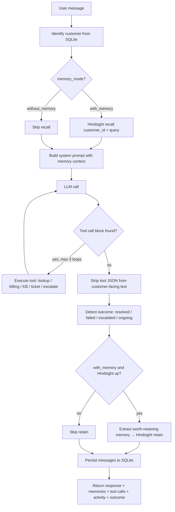

# RecallDesk — Architecture

> Support that remembers what happened.

RecallDesk is an AI customer-support agent for the fictional **Nexora Workspace** (by
**Nexora Cloud**). Its defining feature is a **persistent, per-customer memory layer powered by
[Hindsight](https://hindsight.vectorize.io/)** whose contents visibly change how the agent
responds.

---

## 1. High-level shape

```
┌──────────────────────────┐        ┌──────────────────────────┐
│  React + Vite + Tailwind │  HTTP  │  FastAPI backend         │
│  (localhost:5173)        │ ─────► │  (localhost:8000)        │
│  Dashboard / Chat /      │  /api  │                          │
│  Memory / Demo / Tickets │        │  agent → tools → memory  │
└──────────────────────────┘        └───────┬──────────┬───────┘
                                            │          │
                                  ┌─────────▼──┐   ┌───▼──────────────┐
                                  │  SQLite    │   │  Hindsight       │
                                  │ app data   │   │  (memory banks)  │
                                  │ customers  │   │  embedded OR     │
                                  │ tickets    │   │  external :8888  │
                                  │ messages   │   └──────────────────┘
                                  │ knowledge  │
                                  │ scenarios  │
                                  └────────────┘
```

**The separation is deliberate:** SQLite holds *application* data (who the customer is, what
tickets exist, what was said). Hindsight holds *agent memory* (what this customer experienced and
how it turned out). The application database is **not** a substitute for Hindsight.

---

## 2. Request lifecycle

Every turn runs the same pipeline in `backend/app/agents/support_agent.py::process_message`:



The response payload is what powers the UI's memory badge, activity feed, outcome chip and
before/after comparison.

---

## 3. Backend module map

| Path | Responsibility |
|---|---|
| `app/main.py` | FastAPI app, CORS, lifespan: create tables → init Hindsight → seed demo memories |
| `app/config.py` | Env-driven settings; resolves `.env` from the repo root or `backend/` |
| `app/api/routes/` | `chat`, `customers`, `tickets`, `memory`, `knowledge`, `demo` routers |
| `app/agents/support_agent.py` | The pipeline above: prompt building, tool loop, outcome detection, memory extraction |
| `app/agents/llm_client.py` | Provider-abstracted LLM call with graceful failure |
| `app/hindsight/manager.py` | **The memory layer** — `retain` / `recall` / `reflect` / `create_bank` / `list_memories` + fallback store |
| `app/tools/support_tools.py` | The 9 support tools (lookup, billing, KB, ticket, escalation, memory recall) |
| `app/models/` | SQLAlchemy models: Customer, Ticket, Message, KnowledgeArticle, DemoScenario |
| `app/database/` | Engine/session (`db.py`) and synthetic seed data (`seed.py`) |

---

## 4. Memory layer placement

`app/hindsight/manager.py` is the only module that touches Hindsight. Everything else calls it
through five functions, so the rest of the app never knows *how* memory is stored:

```
create_bank(customer_id, name, plan)     → one bank per customer
retain(customer_id, content, context, metadata)
recall(customer_id, query, budget)       → relevant memories
reflect(customer_id, query)              → deeper synthesis over the bank
list_memories(customer_id)               → enumerate for the Memory panel
```

**Bank naming:** `recalldesk-customer-{customer_id}`. Each bank is created with a *mission* that
tells Hindsight what this memory is for (support history, attempted solutions, outcomes,
preferences), so extraction is scoped to support-relevant facts.

See **[memory-design.md](memory-design.md)** for what is retained and why.

---

## 5. Memory modes and graceful degradation

`HINDSIGHT_EMBEDDED=true` (default) starts a Hindsight server in-process. Otherwise the app
connects to `HINDSIGHT_BASE_URL`. The manager reports exactly which mode is live via
`get_status()`:

| Mode | When | Behaviour |
|---|---|---|
| `hindsight` | A Hindsight server started or was reachable | Full retain/recall/reflect |
| `fallback` | No server reachable | In-process keyword-scored store; demo still works; **UI labels it** |

The fallback store exists so a demo never hard-fails, but it is **never presented as Hindsight**.
`/health`, `/api/v1/memory/status` and every chat response carry the mode, and the frontend shows
"Fallback Memory Mode" or "Memory unavailable for this request".

Per-call failures degrade one step further: if a live `recall()` raises, the manager falls back to
the in-process store for that call and records the error rather than silently pretending success.

---

## 6. Frontend map

| Area | Files |
|---|---|
| Shell / nav | `components/common/Layout.tsx`, `App.tsx` (routes) |
| Chat | `pages/ChatPage.tsx`, `components/chat/ChatWindow.tsx`, `ActivityFeed.tsx` |
| Memory | `pages/MemoryPage.tsx`, `components/memory/MemoryPanel.tsx`, `MemoryTimeline.tsx`, `BeforeAfterPanel.tsx` |
| Demo | `pages/DemoPage.tsx`, `components/demo/ScenarioCard.tsx`, `CustomerProfile.tsx` |
| Operations | `pages/DashboardPage.tsx`, `TicketsPage.tsx`, `KnowledgePage.tsx` |
| Data access | `services/api.ts` (typed axios client), `types/index.ts` |

Routes: `/demo` (default landing), `/dashboard`, `/chat`, `/chat/:customerId`, `/memory`,
`/memory/:customerId`, `/tickets`, `/knowledge`.

The browser only ever talks to the FastAPI backend — **no API key or secret reaches the client**.

---

## 7. Data model (SQLite)

```
Customer 1───* Ticket 1───* Message
Customer 1───* Message
KnowledgeArticle (standalone, general product knowledge)
DemoScenario (standalone, references a customer_id)
```

`Ticket` additionally stores `resolution`, `successful_step`, `failed_steps` (JSON),
`escalation_reason` and `handoff_summary` — the structured outcomes that make escalation handoffs
useful.

---

## 8. Failure behaviour

| Failure | Handling |
|---|---|
| Hindsight unavailable | Labeled fallback store; `/health` reports `mode: fallback` |
| LLM API failure / timeout / rate limit | `llm_client` returns a safe fallback message; the turn does not crash |
| Tool raises | `_execute_tool` catches and returns `{"error": ...}` to the model |
| Unknown customer | Pipeline returns a safe "couldn't locate your account" reply, `outcome: error` |
| No relevant memory | Agent is told "no prior memories found — first interaction" and proceeds generically |
| DB error | Global exception handler returns a generic 500 without leaking internals |

---

## 9. See also

- [memory-design.md](memory-design.md) — retention/recall policy
- [api.md](api.md) — endpoint reference
- [demo-script.md](demo-script.md) — the 3-minute judge walkthrough
- [../README.md](../README.md) — setup and overview
