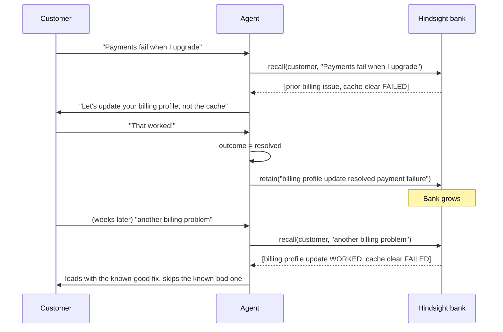

# RecallDesk — Memory Design

This document answers four questions:

1. **What** is retained in Hindsight?
2. **Why** is it retained?
3. **How** is it recalled?
4. **How** does it influence the agent — and how are outcomes recorded?

The goal is a memory that mirrors what a good human support engineer keeps in their head: not a
transcript, but the *few facts that change what you do next time*.

---

## 1. Memory vs. knowledge — an explicit split

| | Knowledge base | Hindsight memory |
|---|---|---|
| Scope | General product documentation | One customer's lived experience |
| Stored in | SQLite (`knowledge_articles`) | Hindsight bank `recalldesk-customer-{id}` |
| Example | "Payment failures are usually caused by an incomplete billing profile." | "For *this* customer, clearing the cache failed; updating the billing profile worked." |
| Lifetime | Static, shared by all | Grows with every interaction |
| Answers | *How does the product work?* | *What already happened to this person, and did it work?* |

The agent receives **both**: the KB tells it *which fix is plausible*, memory tells it *whether
that fix already failed for this customer*.

---

## 2. What is retained (and what is not)

Retention is decided in `support_agent.py::_extract_memory_content`. The policy is deliberately
narrow — **nothing is stored just because it was said**.

Recorded when present:

| Category | Example retained text |
|---|---|
| Issue category | `Support interaction — category: billing` |
| The customer's own words | `Customer message: "my payment keeps failing on upgrade"` |
| Detected outcome | `Outcome: resolved` / `failed` / `escalated` |
| **Successful resolution step** | `SUCCESSFUL RESOLUTION STEP: updating billing profile` |
| **Failed steps (do not retry)** | `FAILED STEPS (do not retry): clearing browser cache` |
| Escalation reason | `Issue was ESCALATED. Reason: billing dispute over $100` |
| Explicit status line | `STATUS: Fully resolved — customer confirmed fix worked.` |
| Durable profile context | Environment, plan, preferences (seeded per customer) |

Deliberately **not** retained:

- greetings, thanks, and small talk,
- the agent's full prose answer,
- raw tool JSON,
- anything below the minimum-length gate (content shorter than 50 chars is dropped).

**Why the narrowness matters:** a memory bank full of noise makes recall worse. `recall` ranks by
relevance, so irrelevant entries dilute the signal that the agent actually needs — "this step
failed before".

---

## 3. How outcomes are detected

`_detect_outcome` (heuristic, regex over the customer message **and** the agent reply) classifies
each turn as one of:

| Outcome | Signal examples | Memory consequence |
|---|---|---|
| `resolved` | "glad that resolved it", "that worked", "problem fixed" | Store as a **successful resolution** worth reusing |
| `failed` | "didn't work", "still not working", "same problem" | Store as a **failed step — do not retry** |
| `escalated` | "escalate", plus the `escalate_ticket` tool firing | Store escalation + reason |
| `ongoing` | no strong signal | Stored as an in-progress interaction |

> **Honesty note:** this is a phrase-based heuristic, not a trained classifier. It is documented as
> a limitation in the README, and the interface is designed so it can be swapped for a model
> without touching anything else.

The system prompt also instructs the agent to say *"Glad that resolved it"* when a fix lands, which
gives the detector a clean, explicit resolution signal.

---

## 4. How memory is recalled

When a message arrives in `with_memory` mode:

```
recall(customer_id, query = the customer's message, budget = "mid")
```

The query is the raw customer message, so semantically similar past incidents float to the top.
Retrieved memories are formatted into the system prompt:

```
━━━ HINDSIGHT MEMORY CONTEXT (recalled from 3 relevant memories) ━━━
  1. [experience] Sarah reported payment failure ... cache clearing FAILED ... billing profile WORKED
  2. [experience] Slack notifications stopped ... re-authorizing OAuth resolved it
  3. [world] Sarah is workspace admin at Vertex Labs, Business plan, Chrome on Windows 11
━━━━━━━━━━━━━━━━━━━━━━━━━━━━━━━━━━━━━━━━━━━━━━━━━━━━━━━━━━━━━━━━━━━━━
```

The prompt then instructs the model to reference prior issues by approximate date, **skip steps
that already failed**, and **start with what previously worked**.

In `without_memory` mode the memory section is replaced by:

```
[MEMORY DISABLED — Generic support mode, no customer history available]
```

This is the mechanism behind the before/after demo: the *only* difference between the two runs is
whether the recalled memories were injected.

---

## 5. How memory changes behaviour

Concrete instructions the agent operates under (from the system prompt):

1. Use memory context to avoid repeating failed solutions.
2. Recommend solutions based on what previously worked **for this customer**.
3. **NEVER** recommend a troubleshooting step that memory shows already failed for this customer.
4. Escalate after repeated failures, carrying the full context.

Worked example:

| | Without memory | With Hindsight |
|---|---|---|
| Message | "My payment failed again upgrading." | "My payment failed again upgrading." |
| Recalled | — | previous billing issue; cache clear **failed**; billing-profile update **worked** |
| Response | "Try clearing your cache and retrying the payment." | "Cache clearing didn't resolve this last time — updating your billing profile did. Let's check that first." |

---

## 6. Lifecycle diagram



---

## 7. Bank configuration

Each customer bank is created with a mission describing its purpose:

```
I am a customer support memory bank for {name}.
I track this customer's support history, problems, attempted solutions,
outcomes, preferences, and product environment for Nexora Workspace ({plan} plan).
I remember what worked, what failed, and what was promised.
```

and a disposition (`skepticism: 2, literalism: 4, empathy: 4`) tuned for support conversations.
Metadata attached on retain (`outcome`, `ticket_id`, `session_id`, `plan`) makes memories
filterable and auditable.

---

## 8. Failure and fallback policy

- **Hindsight unreachable** → an in-process keyword-scored store is used, and the mode is surfaced
  to the UI as *fallback*. Memory-dependent behaviour still works for the demo, but is honestly
  labelled.
- **A single recall/retain call fails** → the manager falls back for that call and logs the error;
  the chat response carries `hindsight_status` so the UI can say *"Memory unavailable for this
  request."*
- **Retention failure** → recorded in the activity feed (`Memory retention failed: …`) rather than
  swallowed.

The application never claims a memory was stored or recalled when it was not.

---

## 9. Known limitations

- Outcome detection is regex-based, not learned.
- Memory extraction is rule-based (category inference + tool results), not an LLM extraction pass.
- The fallback store is per-process and not persistent across restarts.
- Embedding/reranker backends are chosen by Hindsight; on machines where the local ML stack cannot
  load, a remote embedder + `rrf` reranker must be configured (see `.env.example`).
